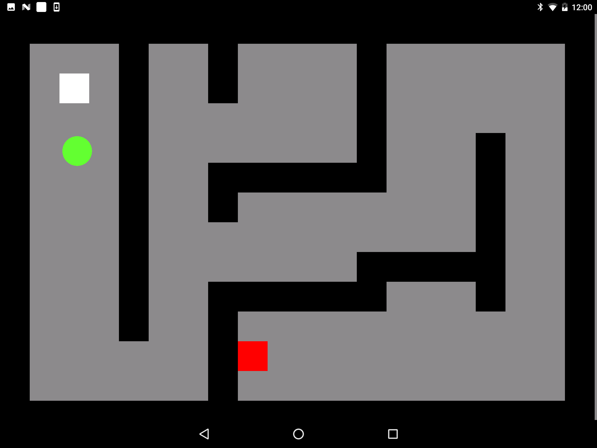
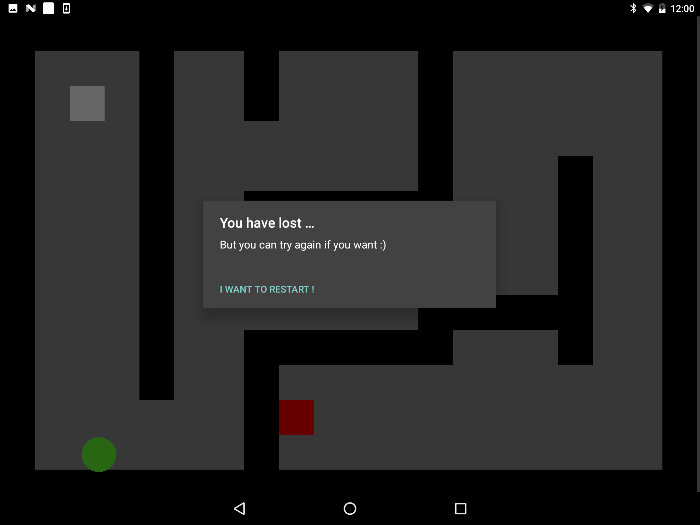
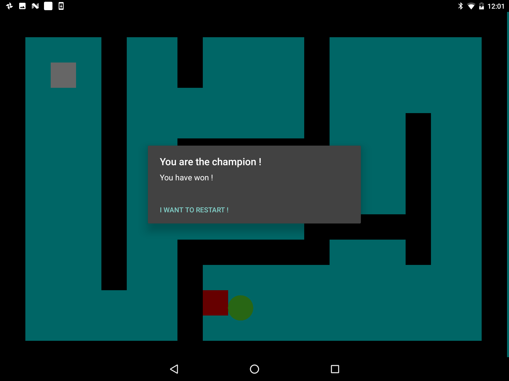

<p align="center">
  
</p>

An Android labyrinth game :space_invader:

## Screenshots
  

## Functionnality

- Based on [**OC tutorial**](https://openclassrooms.com/courses/creez-des-applications-pour-android/tp-un-labyrinthe)
- Change background contrast according to luminosity level.
- Change ball color according to magnetism level.
- Detect if user is moving while playing and tell him to keep calm :trollface:.
- Play familiar sounds when you walk, win or loose !

## Compatibility

<table>
<tr>
  <th><b>Min. version</b></th>
  <th><b>Targeted version</b></th>
  <th><b>Compiled version</b></th>
  <th><b>Android Studio v. used</b></th>
</tr>
<tr>
  <th>Android 4.4</th>
  <th>Android 7.1.1</th>
  <th>Android 7.1.1</th>
  <th>2.3.2</th>
</tr>
</table>

Working on :
- Smartphone
- Tablet

## Installation

- Clone this repository.
```sh
git@github.com:istornz/LabyMotion.git
```
- Open the project with [**Android Studio**](https://developer.android.com/studio/index.html)
- Build & run the project.
- Profit and have fun :tada:

## Usage

#### Basic usage
- Just open the app & rotate your device to avoid black border.
- Just don't walk on playing it's dangerous :bowtie:.

## Others

This app was based on [**OpenClassroom tutorial made by Frédéric Espiau**](https://openclassrooms.com/courses/creez-des-applications-pour-android/tp-un-labyrinthe)

© Dessus Dimitri - 21/05/2017